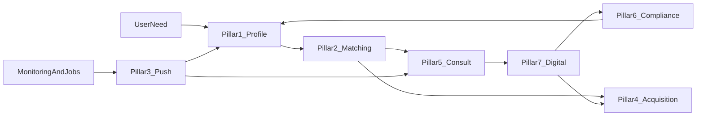
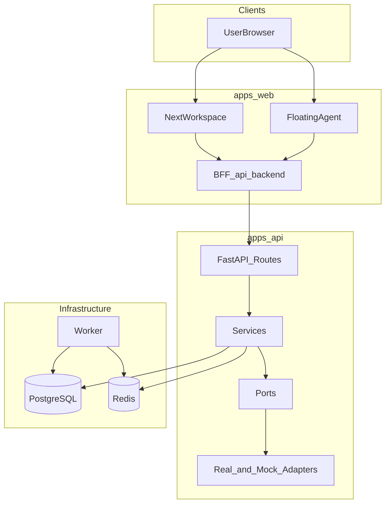

# A1+ IP Coworker · 产品文档（PPT 协作版）

> **版本**：2026-04  
> **用途**：供 PPT / 路演同学快速理解项目，对齐「AI + 知识产权法律服务」赛题七大方向。  
> **路演页**：Web 端 `/pitch`；详细口播见 [`demo-script.md`](demo-script.md)。

---

## 1. 项目概述

| 项目 | 说明 |
|------|------|
| **名称** | A1+ IP Coworker |
| **一句话** | 面向中国小微创业者与 OPC 的 **AI 知识产权主动协作平台**：从一句话需求到律师匹配、咨询、委托、合规与资产运营，全链路可解释、可演示。 |
| **赛题对标** | 「AI + 知识产权法律服务」参考方向 **全覆盖**：需求画像、智能匹配、场景化推送、精准获客、智能咨询、合规 SaaS、服务数字化。 |
| **核心创新** | **七支柱飞轮闭环** + **C / B / E 三端同一套画像与订单** + **可解释 AI Agent（法务大脑）** + **Mock / Real 数据模式透明**。 |

**PPT 可摘金句**

- 「不是单点工具，是一条从需求到履约的 IP 法律服务闭环。」
- 「七大方向在代码里一一对应七个产品支柱，评委可对表验货。」

---

## 2. 目标用户画像

| 端 | 典型用户 | 核心痛点 | 产品价值 |
|----|----------|----------|----------|
| **C 端** | 小微创业者、个体户、OPC | 不懂 IP 流程、找律师难、怕踩坑 | 免费 AI 首诊、需求指纹、Top-K 匹配、一键咨询 / 下单 |
| **B 端** | 律师 / 代理机构 | 获客贵、线索冷、转化难 | 带画像与命中原因的线索、温度分级、漏斗与 ROI、客户360° |
| **E 端** | 中小企业法务 / 创始人 | 合规碎片化、政策跟不上 | IP 合规体检、风险热力图、政策雷达、订阅分层、发现一键委托 |

**PPT 可摘金句**

- 「一张画像，三端复用：C 端用来匹配，B 端用来接单，E 端用来体检与续约。」

---

## 3. 七支柱能力矩阵（赛题 ↔ 产品）

以下每条均包含：**定位** · **场景** · **功能** · **技术亮点** · **入口**。

### 支柱 1 · 需求画像

| 维度 | 内容 |
|------|------|
| **定位** | 把「一句话需求」变成可计算、可追溯的标签与指纹。 |
| **场景** | 用户描述业务与诉求；诊断等自助工具产出回写画像。 |
| **功能** | 意图 / 紧迫度 / 预算 / 地域抽取；静态字段 + 行为信号（诊断、资产、失败任务等）融合；标签时间线。 |
| **技术** | 关键词规则优先 + `PROFILE_LLM_FALLBACK` 低置信时 LLM 兜底；落库 `UserProfileTag`。 |
| **入口** | `/my-profile`；子能力：`/diagnosis`（IP 规划）。 |
| **后端参考** | `apps/api/app/services/profile_engine.py`，`/profile/fingerprint`、`/profile/tags` |

### 支柱 2 · 智能匹配

| 维度 | 内容 |
|------|------|
| **定位** | 将需求指纹映射到律师 / 代理，**可解释排序**。 |
| **场景** | 咨询页提交需求、画像页「重新生成」、历史匹配复盘。 |
| **功能** | 候选列表、匹配分、Top命中原因、与订单 / 线索联动。 |
| **技术** | **双路召回**：标签硬过滤 + 标签向量余弦；**RRF** 合并；再经 MatchingPort 重排；高质量结果生成 `ProviderLead`。 |
| **入口** | `/match`、`/match/[id]` |
| **后端参考** | `apps/api/app/services/matching_engine.py`，`adapters/real/matching.py`、`matching_embedding.py` |

### 支柱 3 · 场景化推送

| 维度 | 内容 |
|------|------|
| **定位** | 基于 **事件 + 定时** 的规则引擎，把「该办事了」推到收件箱 / 时间线。 |
| **场景** | 诊断完成跟进、商标红旗、资产临期、监控命中、合规低分、新线索、订单沉默、诉讼高风险等。 |
| **功能** | 规则库开关、模拟触发、推送时间线；与 `Notification` 联动。 |
| **技术** | `AutomationRule`：`cron` / `event` 触发；动作含入队任务、推进工作流、通知、场景推送；内置 **12+** 条场景规则。 |
| **入口** | `/push-center`；子能力：`/monitoring` |
| **后端参考** | `apps/api/app/services/automation_engine.py`，`apps/api/app/api/routes/automation.py` |

### 支柱 4 · 精准获客

| 维度 | 内容 |
|------|------|
| **定位** | B 端：**有温度的线索** + **可量化漏斗** + **ROI**。 |
| **场景** | 律所合伙人看今日高意向线索；团队分配；复盘渠道与品类。 |
| **功能** | 线索池认领 / 分配、客户 360°、产品货架、**五阶段漏斗**（派发→查看→认领→报价→成交）、归因报表。 |
| **技术** | 线索温度：匹配分、紧迫度、预算、新近度、活动等加权；与订单流水聚合 ROI。 |
| **入口** | `/provider` |
| **后端参考** | `apps/api/app/services/provider_crm.py`，`/provider-leads/*` |

### 支柱 5 · 智能咨询

| 维度 | 内容 |
|------|------|
| **定位** | **多工具 Agent 首诊**；低置信或强人工意图时 **一键转律师**。 |
| **场景** | 浮窗或咨询页自然语言提问；商标 / 合同 / 政策 / 尽调等工具链组合调用。 |
| **功能** | 流式对话、工具调用可视化、跟进建议 chips；咨询会话与订单衔接。 |
| **技术** | `chat_service`：**12 个工具**（见第 5 节）；单轮工具预算 ≤ 3；自动 handoff 与会话置信度跟踪。 |
| **入口** | `/consult`；子能力：`/litigation`（诉讼预测）、`/due-diligence`（融资尽调） |
| **后端参考** | `apps/api/app/services/chat_service.py`，`apps/api/app/services/order_service.py`（咨询会话） |

**诉讼智能（咨询支柱下的深度模块）**

- **页面** `/litigation`：案情录入、胜诉率 / 赔偿区间 / 周期、策略卡、证据清单 **实时情景推演**、类案引用。  
- **Agent**：`predict_litigation` 工具；**自动化**：如 `litigation_high_risk`、`litigation_ready_to_file` 触发推送。  
- **API**：`/litigation/cases`、`/predict`、`/simulate`、`/litigation/quick` 等（详见原技术小节与 `demo-script.md` 脚本 D）。

### 支柱 6 · 合规 SaaS

| 维度 | 内容 |
|------|------|
| **定位** | 企业 **持续** IP 合规运营，而非一次性 PDF。 |
| **场景** | 融资前体检、日常巡检、政策突变响应。 |
| **功能** | 合规分、多维风险热力、发现列表、审计报告、政策雷达、**订阅分层**（配额与功能）。 |
| **技术** | `ComplianceProfile` + `ComplianceFinding`；审计走 `ComplianceAudit` 端口；订阅与政策订阅配额。 |
| **入口** | `/enterprise`；子能力：`/contracts`、`/policies` |
| **后端参考** | `apps/api/app/services/compliance_engine.py`，`/compliance/*` |

### 支柱 7 · 服务数字化

| 维度 | 内容 |
|------|------|
| **定位** | 委托全链路 **里程碑 + 电子签 + 托管支付 + 交付物**。 |
| **场景** | 从匹配结果下单 → 报价 → 签约 → 托管 → 交付 → 验收释款 → 评价。 |
| **功能** | 订单时间轴、状态机、与资产台账联动；商标工作流（查重、申请书、提交引导）支撑交付物。 |
| **技术** | `ServiceOrder` 状态机；`eSignature`、`paymentEscrow` 端口；工作流 `trademark-registration` 多步编排。 |
| **入口** | `/orders`；子能力：`/trademark/check`、`/assets` |
| **后端参考** | `apps/api/app/services/order_service.py`，`apps/api/app/services/workflow_engine.py`，`adapters/real/escrow.py`、`esignature.py` |

**PPT 可摘表**：直接把上表七行做成「赛题关键词 → 我们叫什么 → 哪个 URL」一页。

---

## 4. 飞轮闭环数据流

用户每一次行为更新画像 → 触发匹配与线索 → 咨询与订单沉淀数据 → 合规与监控产生事件 → **场景推送**拉回用户 → 画像再次增强。



**PPT 可摘金句**

- 「闭环的关键是 **事件总线 + 自动化规则**：不是做完一单就结束，而是持续触达与回灌画像。」

---

## 5. AI Agent（法务大脑）架构

### 5.1 十二工具清单

| # | 工具名 | 用途（一句话） |
|---|--------|----------------|
| 1 | `trademark_check` | 商标查重与风险判断 |
| 2 | `ip_diagnosis` | IP 诊断与策略建议 |
| 3 | `list_assets` | 读取用户 IP 资产台账 |
| 4 | `generate_application` | 申请书类产出与引导 |
| 5 | `contract_review` | 合同知识产权条款辅助审查 |
| 6 | `patent_assess` | 专利相关评估 |
| 7 | `policy_digest` | 政策摘要与速递 |
| 8 | `find_lawyer` | 触发匹配 / 找律师 |
| 9 | `request_quote` | 询价与订单前置 |
| 10 | `start_consultation` | 开启咨询会话 / 转人工路径 |
| 11 | `compliance_scan` | 合规扫描 / 体检入口 |
| 12 | `predict_litigation` | 诉讼预测与类案结构化结论 |

### 5.2 置信度与转人工

- 对话轮次结束可计算 **置信度**；低于阈值或命中「要律师 / 诉讼 / 被起诉」等信号 → **自动创建咨询会话或 handoff**。  
- 咨询会话内持续更新 AI 置信度，过低时引导 **转真人律师**（与 `/orders` 衔接）。

### 5.3 可靠性与边界

- **LLM 失败 → 规则兜底**：适配器层捕获异常，返回确定性结果，避免演示与生产「白屏」。  
- **工具预算**：单轮最多 **3** 次 tool call，控制时延与成本。  
- **法律声明**：所有 AI 输出附带「仅供参考，以官方为准」；**不代替用户向官方系统递交**。

**PPT 可摘金句**

- 「Agent 不是聊天机器人，是 **带工具边界与转人工协议** 的法务编排器。」

---

## 6. 技术架构概览

| 层 | 技术选型 | 说明 |
|----|----------|------|
| **Web** | Next.js App Router、React 19、Tailwind | 工作区页面 + `/pitch` 路演页 + BFF |
| **BFF** | `/api/backend/[...path]` | 可代理 FastAPI；`NEXT_PUBLIC_API_MODE=mock` 时可 **纯前端 Mock**，保障演示稳定 |
| **API** | FastAPI、Pydantic v2、SQLAlchemy | **六边形架构**：`ports/interfaces.py` + `adapters/real|mock` |
| **数据** | PostgreSQL（Compose 默认）、Redis | 会话、任务、事件、订单等 |
| **异步** | `apps/worker` | 轮询作业：诊断、商标、监控、合同、政策、线索温度、续展提醒等 |
| **响应契约** | `DataSourceEnvelope` | 统一 `mode: real \| mock`、`traceId`、免责声明，**不跨模式聚合数据** |



**领域模块与代码导航（评委追问用）**

| 模块 | 前端 | 后端 |
|------|------|------|
| 咨询与匹配 | `components/workspace/consult.tsx`、`match.tsx` | `matching_engine.py`、`routes/matching.py` |
| 订单 | `components/workspace/orders.tsx` | `order_service.py`、`routes/orders.py` |
| 律师工作台 | `components/workspace/provider.tsx` | `provider_crm.py`、`routes/providers.py`、`leads.py` |
| 企业合规 | `components/workspace/enterprise.tsx` | `compliance_engine.py`、`routes/compliance.py` |
| 场景推送 | `components/workspace/push-center.tsx` | `automation_engine.py`、`routes/automation.py` |
| Agent | `components/agent/floating-agent.tsx` | `chat_service.py` |
| 诉讼 | `components/workspace/litigation.tsx` | `litigation_service.py`、`routes/litigation.py` |

**演示种子**

```bash
python -m apps.api.scripts.seed_demo
# 示例账户见 demo-script.md
```

---

## 7. 演示脚本（压缩版）

详细口播与 Q&A 见 **[`docs/demo-script.md`](demo-script.md)**。以下为 PPT 时间轴提纲。

### 7.1 约 3 分钟 · C 端闭环

1. 登录 → `/consult` 或浮窗输入一句话需求。  
2. 展示 **需求指纹** + **Top 3 律师**（分数 + 命中原因）。  
3. 「发起咨询」→ `/orders`；再 `/match` 看历史。  
4. **收口**：一句话 → 画像 → 匹配 → 委托，全程可追溯。

### 7.2 约 2.5 分钟 · B 端获客

1. `/provider`：KPI、ROI、漏斗。  
2. 线索池：温度、认领、画像标签。  
3. 产品与客户 CRM。  
4. **收口**：AI 派单，不是冷名单。

### 7.3 约 2.5 分钟 · E 端合规

1. `/enterprise`：分数、五维热力、发现 + 一键委托。  
2. 政策雷达、订阅档位。  
3. **收口**：持续运营，不是卖 PDF。

### 7.4 压轴 · 诉讼智能（2.5–3 分钟）

1. `/litigation`：加载 Demo 案情 → **预测** → 证据勾选 **simulate** 胜率变化。  
2. 浮窗追问「能打赢吗」→ `predict_litigation`。  
3. **收口**：结构化评估 + 可解释因子 + Agent 联动 + 推送规则。

---

## 8. 竞赛差异化与商业模式（简述）

| 对比 | 我们的说法 |
|------|------------|
| **vs 传统法律 SaaS** | 单点工具解决「一个环节」；我们是 **OS级闭环**（画像→匹配→订单→合规→事件推送）。 |
| **vs 通用大模型** | 不是黑箱对话；**标签、命中原因、模式位、工具调用** 全链路可解释、可审计。 |
| **商业模式（叙述级）** | C 端：免费能力 + 成交佣金；B端：线索 / 席位订阅；E 端：合规 SaaS 分层；诉讼等深度能力可按案增值。 |

---

## 附录 A · 核心数据模型（便于 PPT「架构浅底」）

- 供给侧：`LegalServiceProvider`、`ProviderCredential`、`ServiceProduct`  
- 画像与匹配：`UserProfileTag`、`MatchingRequest`、`MatchingCandidate`、`ProviderLead`  
- 服务数字化：`ConsultationSession`、`ServiceOrder`  
- 企业合规：`ComplianceProfile`、`ComplianceFinding`  
- 诉讼：`LitigationCase`、`LitigationPrediction`、`LitigationScenario`、`LitigationPrecedent`  

---

## 附录 B · 关键 API 索引

| 路径 | 方法 | 说明 |
|------|------|------|
| `/matching/run` | POST | 画像 + 召回 + 重排 |
| `/matching` | GET | 历史匹配 |
| `/matching/{id}` | GET | 匹配详情 |
| `/provider-leads` | GET | 线索池 |
| `/provider-leads/{id}/claim` | POST | 认领 |
| `/provider-leads/roi` | GET | ROI |
| `/provider-leads/funnel` | GET | 漏斗 |
| `/orders` | GET/POST | 订单 |
| `/orders/{id}/{action}` | POST | 报价 / 签 / 托管 / 交付 / 验收 |
| `/consultations` | GET/POST | 咨询会话 |
| `/chat/stream` | POST | Agent SSE |
| `/compliance/profile` | GET | 合规画像 |
| `/compliance/audit` | POST | 体检 |
| `/compliance/policy-radar` | GET | 政策雷达 |
| `/automation/rules` | GET/PUT | 自动化规则 |
| `/litigation/cases` | GET/POST | 诉讼案件 |
| `/litigation/cases/{id}/predict` | POST | 预测 |
| `/litigation/cases/{id}/simulate` | POST | 情景推演 |

---

## 附录 C · 设计约束（交付与答辩一致）

1. **模式隔离**：`real` / `mock` 不混算；响应带 `mode`。  
2. **LLM Fallback**：真实适配器失败回落规则，避免不可用。  
3. **Agent Tool Budget**：单轮 ≤ 3 次 tool call。  
4. **免责声明**：全站 AI 输出提示「仅供参考，以官方为准」。  
5. **转人工**：低置信与高风险意图走 `start_consultation` / handoff。

---

## 附录 D · 后续规划（简述）

- 合规 / 订单 PDF 正式渲染与真实电子签、托管支付对接  
- 律师端移动化（PWA / 小程序）  
- 知识库 RAG 与引用溯源加强  

---

*文档与代码入口对齐：`README.md` 七支柱表、`packages/domain/src/index.ts` 模块定义、`apps/web/src/app/pitch/page.tsx` 路演页。*
