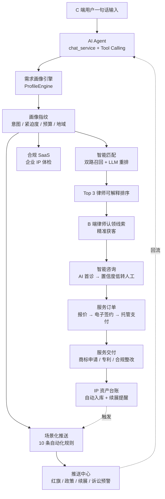
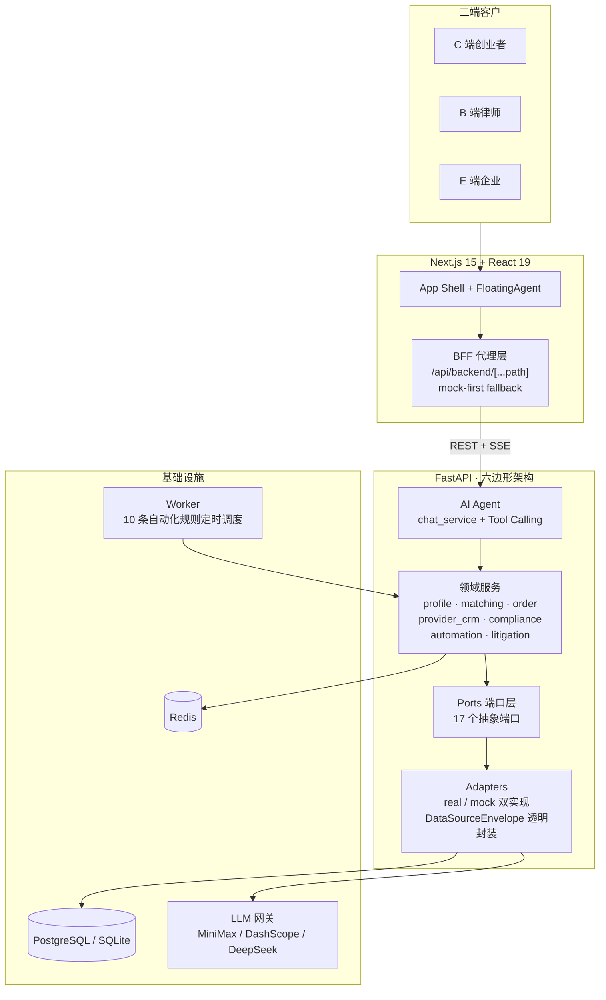

# A1+ IP Coworker — 赛事产品介绍

> **赛题**：AI + 知识产权法律服务
>
> **版本**：A1+ 2.0（2026-04）
>
> **本文档用途**：供 PPT 制作伙伴快速拎取素材，每一节对应 1–2 页幻灯片

---

## 一、封面与电梯演讲

### 一句话定位

> **A1+ IP Coworker = AI 法律操作系统**
>
> AI Agent 驱动 + 三端空间（C 创业者 / B 律师 / E 企业）+ 服务数字化闭环 + 数据模式透明

### 一眼可见的竞赛亮点

| 维度 | 数字 | 说明 |
|------|------|------|
| **赛题覆盖** | **7 / 7** | 赛题列出的 7 个可参考方向，全部落地为具体页面与 API |
| **系统深度** | **17** 个端口适配器 | 六边形架构，每个端口 real / mock 双实现可切换 |
| **自动化规则** | **10** 条场景化触发 | 覆盖诊断→匹配、红旗→预警、低胜率→和解等 |
| **用户 ROI** | 节省 **80–95%** 成本与时间 | 对比传统律所服务（数据源：BRD ROI 表） |
| **王牌加码** | 诉讼智能预测 | 超出赛题 7 项之外，是 Demo 压轴 |

### PPT 一句话金句

> 我们不是一个"IP 工具 SaaS"，**我们是一套覆盖 C/B/E 三端、AI Agent 贯穿始终的"AI 知识产权法律操作系统"**。

---

## 二、赛题对齐 · 七个方向 100% 落地

这是全文最重要的一页，建议作为 PPT 第 2 页直接展示。

| # | 赛题关键词 | 对应 UI 入口 | 后端服务 / 数据模型 | 一句 Demo 台词 |
|---|------------|--------------|-------------------|--------------|
| 1 | **需求画像** | `/consult` 画像指纹卡 + `/my-profile` | `profile_engine` · `UserProfileTag` | "让用户一句话输入，秒成结构化需求指纹" |
| 2 | **智能匹配** | `/match` · `/consult` Top 3 卡 | `matching_engine`（双路召回 + LLM 重排） · `MatchingCandidate` | "两阶段匹配，秒出最合适的 Top 3 律师" |
| 3 | **场景化推送** | `/push-center` · Inbox | `automation_engine` 10 条 `BUILTIN_RULES` · `Notification` | "诊断完 → 派律师；资产到期 → 催续展" |
| 4 | **精准获客** | `/provider` > 线索池 | `provider_crm` + ROI 统计 · `ProviderLead` | "AI 把在画像的潜客自动派发给律师" |
| 5 | **智能咨询** | `/consult` + 浮动 Agent | `chat_service` + 4 个工具调用 · `ConsultationSession` | "AI 首诊，置信度低自动转人工律师" |
| 6 | **合规 SaaS** | `/enterprise` 4 个 Tab | `compliance_engine` · `ComplianceProfile` + `ComplianceFinding` | "一键企业 IP 合规体检，出雷达图 + 行动路径" |
| 7 | **服务数字化** | `/orders` + `/provider` 订单 | `order_service`（报价 → 签约 → 托管 → 交付 → 评价） · `ServiceOrder` | "从委托到结算，全链路数字化 + 托管支付" |

### PPT 一句话金句

> **赛题列的 7 个方向，我们一个都没少——而且每一个都有后端、有 UI、有 Demo 台词。**

---

## 三、目标用户 — 三端画像

A1+ 同时覆盖 **C / B / E** 三端，这是与单端"律所获客 SaaS"或"企业合规 SaaS"的核心差异。

| 端 | 用户 | 规模 | 核心痛点 | 对应入口 |
|----|------|------|---------|---------|
| **C 端** | 小微企业主 / OPC / 内容创作者 | 中国 ~6000 万户 | "不知道要保护什么、去哪保护、花多少钱" | `/consult` · `/diagnosis` · `/trademark/*` |
| **B 端** | 律师 / IP 代理机构 | 中国 ~30 万人 | "获客难、线索质量低、成交周期长" | `/provider` 工作台（5 Tab） |
| **E 端** | 成长期企业 | 中国 ~500 万家 | "合规没抓手、政策跟不上、IP 资产成盲盒" | `/enterprise` 合规 SaaS |

### PPT 一句话金句

> **一张画像喂三端**：C 端的需求标签，就是 B 端的精准线索，也是 E 端合规画像的输入。

---

## 四、主旅程一图看懂

下面这张图建议做成 PPT 中的主旅程示意图。

### 这张图要在 PPT 上强调 3 个"回路"

1. **画像 → 匹配 → 获客 → 咨询 → 订单**：C 到 B 的精准转化链
2. **订单 → 资产 → 推送**：服务交付后的持续触达（续展、监控、政策）
3. **推送 → Agent**：主动能力回流到 AI 对话，形成二次唤起

### PPT 一句话金句

> **一句话进来 → AI 贯穿 → 服务闭环 → 资产沉淀 → 主动回访**，这就是"法律 OS"和"工具 SaaS"的差别。

---

## 五、七大支柱逐一展开

每个支柱固定模板：**一句话定位 · 核心能力 3 点 · 一句 Demo 台词 · 后端亮点（Q&A 弹药）**。

---

### 支柱 1 · 需求画像

**一句话定位**：让非专业用户用一句话把自己说清楚，AI 完成结构化抽取。

**核心能力**：

- **规则 + LLM 双路抽取**：先用关键词规则兜底（意图 / IP 类型 / 紧迫度 / 预算 / 地域），LLM 仅做补全与纠偏
- **画像指纹卡**：把抽取结果可视化为"可见、可改、可复用"的标签指纹
- **全站复用**：画像直接喂给匹配、推送、合规三条下游链路，无需用户二次填写

**Demo 台词**：

> "用户输入：'我在做跨境电商，刚给产品起了名字，想尽快注册商标。' — 0.8 秒后，画像卡出现：意图=商标、紧迫度=高、地域=上海+欧洲、关键词标签={trademark, cross-border, brand}。"

**后端亮点**：`services/profile_engine.py` · `PROFILE_LLM_FALLBACK` 可配置 · 输出 `UserProfileTag` 供全系统消费。

---

### 支柱 2 · 智能匹配

**一句话定位**：用"双路召回 + LLM 重排"为用户精准推荐 Top 3 律师，每一次推荐都可解释。

**核心能力**：

- **双路召回**：关键词路（业务类型、地域、IP 类型精确匹配）+ 向量路（语义相似度）→ **RRF 融合**
- **LLM 重排 + 解释生成**：对召回候选做重排，并为每位律师生成"为什么推荐 TA"的自然语言解释
- **可解释 UI**：每张律师卡带匹配分、匹配原因、响应 SLA、推荐产品与报价

**Demo 台词**：

> "推荐李律师（92 分），因为：专长跨境商标、上海本地可面签、近 3 个月处理过 12 件同类案件、平均响应 2.3 小时。"

**后端亮点**：`services/matching_engine.py` + `adapters/real/matching.py` + `matching_embedding.py` · 支持 keyword / embedding / hybrid 三档切换（`PROFILE_MATCHING_MODE`）· LLM 失败自动降级。

---

### 支柱 3 · 场景化推送

**一句话定位**：基于画像与资产状态，**10 条**规则自动触发主动推送，让服务"找上门"。

**核心能力**：

- **10 条 `BUILTIN_RULES`** 覆盖主要生命周期：
  1. `diagnosis_to_match`：诊断完成 → 推荐律师
  2. `trademark_red_flag`：查重红旗 → 咨询律师入口
  3. `asset_expiring_renewal`：资产到期 90 天 → 续展提醒
  4. `monitoring_infringement_hit`：监控命中 → 一键维权
  5. `policy_hit_compliance`：政策命中 → 合规建议
  6. `provider_fresh_lead`：高分线索 → 律师端催办
  7. `compliance_score_low`：合规评分 <60 → 改善计划
  8. `order_silent_followup`：订单沉默 48h → 双向催办
  9. `litigation_high_risk`：胜率 <40% → 和解建议
  10. `litigation_ready_to_file`：胜率 ≥70% + 证据分 ≥8 → 一键委托
- **统一通知中心**：`/push-center`
- **规则可视化**：每条推送带"为什么推"，点开可回溯触发条件

**Demo 台词**：

> "用户刚做完诉讼预测，胜率 32% — 30 秒后收到推送：'建议先行和解，我们为您匹配了 2 位擅长和解的律师。'"

**后端亮点**：`services/automation_engine.py` · 由 Worker 定时轮询触发，与业务事件解耦。

---

### 支柱 4 · 精准获客（B 端律师工作台）

**一句话定位**：把 C 端在画像的潜客，变成律师端可操作、可度量的精准线索。

**核心能力**：

- **5 阶段获客漏斗**：新增 → 认领 → 接触 → 报价 → 成交
- **线索温度分档**：热 / 温 / 冷，带匹配分 + 热图 + 画像标签
- **律师 360° 客户 CRM**：历史对话、LTV、服务产品上架、ROI 看板
- **组内分配**：律所可把线索分配给助理，查看动作写回系统

**Demo 台词**：

> "律师打开工作台：今天新增 3 条热线索 — 1 条跨境商标（92 分）、1 条专利转让（88 分）、1 条版权维权（84 分）。一键认领后，状态改为'跟进中'，客户侧同步收到'您的专属顾问已就位'。"

**后端亮点**：`services/provider_crm.py` · `/provider-leads/*` API · ROI 指标可实时计算。

---

### 支柱 5 · 智能咨询

**一句话定位**：AI Agent 首诊兜底一切入口，**置信度低自动转人工**，避免"AI 乱答坏事"。

**核心能力**：

- **浮动 AI（FloatingAgent）常驻**：任何页面右下角都可唤起，输入即跳 `/consult?prefill=...`
- **4 个 Tool Calling**：`find_lawyer` / `request_quote` / `start_consultation` / `compliance_scan`（未来扩展到诉讼预测工具）
- **置信度评估 + 转人工**：置信度低或用户出现"要律师 / 法务 / 人工"等意图时，Agent 自动调用 `start_consultation` 转真人
- **Tool Budget ≤ 3**：单轮最多调 3 次工具，防止 Agent 抖动爆字
- **全量免责声明**：所有回答自动附"仅供参考，以官方为准"

**Demo 台词**：

> "用户在任何页面问：'我这个商标被抢注了怎么办？' — AI 秒答风险 + 直接推送 2 位擅长异议律师 + 生成一键委托入口。"

**后端亮点**：`services/chat_service.py` · `CHAT_TOOLS` · SSE 流式返回。

---

### 支柱 6 · 合规 SaaS（E 端企业体检）

**一句话定位**：让企业 IP 合规从"年度盲盒"变成"月度仪表盘"。

**核心能力**：

- **合规总览**：百分制 Donut + **五维雷达**（品牌保护 / 技术知识产权 / 版权管理 / 合同风险 / 国际化程度）
- **一键体检**：AI 自动扫描企业画像、资产、政策匹配，生成发现列表
- **政策雷达**：实时匹配企业标签的法规动态 + 影响等级 + 行动建议
- **订阅分层**：Free / Pro / Enterprise，高档解锁专家解读与 PDF 报告导出
- **发现 → 委托**：每条发现都带推荐产品和一键委托律师按钮，形成"发现→成交"闭环

**Demo 台词**：

> "企业账号登录 → 合规总览 62 分（黄色预警）→ 一键体检 → 3 分钟产出 5 个发现，其中 2 个高优先级自动推律师，管理员点击'一键委托'即下单。"

**后端亮点**：`services/compliance_engine.py` · `/compliance/audit` · `/compliance/policy-radar`。

---

### 支柱 7 · 服务数字化

**一句话定位**：从报价到结算全链路数字化，**托管支付 + 电子签约**让小微用户敢下单。

**核心能力**：

- **里程碑时间轴**：每个订单拆成若干里程碑，双方可追踪
- **托管支付（Escrow）**：用户先付到托管账户，服务交付验收后再释放给律师
- **电子签约**：委托合同在线签，不用线下跑
- **IP 资产台账**：服务交付后自动入库（商标 / 专利 / 版权 / 软著），自动接入续展提醒
- **完整商标办理**：查重 → 申请书生成（DOCX+PDF） → CNIPA 提交指引 → 台账登记

**Demo 台词**：

> "用户委托商标注册 → 电子签约 → 托管支付 300 元 → 里程碑亮灯：查重完成 / 申请书生成 / 已指引 CNIPA 提交 → 资产自动入台账 → 第 9 年自动推送续展提醒。"

**后端亮点**：`services/order_service.py` · `PaymentEscrowPort` + `ESignaturePort`（2.0 新增端口，默认 mock，可切换真实 DocuSign / 易签等）。

### PPT 一句话金句

> **AI 做前置智能（画像/匹配/推送/合规），数字化做后置履约（订单/签约/托管/台账）——前后贯通才叫 OS。**

---

## 六、王牌加码 · 诉讼智能预测（Demo 压轴）

> 这是赛题 7 项之外的"超纲能力"，建议作为 PPT 倒数第二页，Demo 结尾压轴使用。

**一句话定位**：用**确定性公式 + LLM + 判例库**，把一个案子 3 秒内变成"胜率 / 金额 / 周期 / 策略 / 判例"的五维仪表盘。

**核心差异化**：

| 维度 | 说明 |
|------|------|
| **可解释** | 胜率不是黑盒，由基础判例胜率 × 角色 × 管辖 × 证据分 × 对手规模 × 谈判 × 专家证人等**乘积公式**生成，每个因子都在 UI 上可见 |
| **可复现** | mock 模式使用确定性公式，Demo 每次数字一致，不会"AI 又抽风" |
| **实时情景推演** | 勾选/取消证据 → 胜率 DonutRing **实时跳数**（Demo 亮点） |
| **自动提示** | 胜率 <40% 自动推和解、≥70% 自动推立案，接入推送规则 9 / 10 |

**Demo 视觉冲击点**：

> "勾选 3 条关键证据 → 胜率从 **32% 实时跳到 58%**，风险等级从红→黄，界面上方浮现 **+26%**。"

**后端亮点**：`LitigationPredictorPort` · `LitigationCase` / `LitigationPrediction` / `LitigationScenario` / `LitigationPrecedent` 四张表 · Agent `predict_litigation` 工具（任何页面聊"能打赢吗"都能触发）。

### PPT 一句话金句

> **AI 把资深律师 1 周才能给出的判断，压到 3 秒钟 — 而且每一次勾选都在实时改写胜率的边际贡献。**

---

## 七、系统架构一页纸

**3 个评委关键词**：

- **Hexagonal Ports & Adapters**：17 个端口，每个端口 real/mock 双实现，切换仅靠环境变量
- **数据源透明**：每条响应封装在 `DataSourceEnvelope`，前端可见 `mode: real | mock`，**绝不混合聚合**
- **LLM + 规则双路兜底**：LLM 失败自动降级到规则引擎，不会返回 502

### PPT 一句话金句

> **17 个端口 + real/mock 双实现 + DataSourceEnvelope 透明 = 这个 Demo 在任何网络环境下都能跑起来，且每个数字都能说清来源。**

---

## 八、4 段 Demo 脚本摘要（路演备稿）

完整版见 [docs/demo-script.md](demo-script.md)，此处为 PPT 备注 / 口播用摘要。

### 脚本 A · C 端一句话委托（3 min）

- **场景**：跨境电商创业者想注册商标
- **动作**：① `/consult` 输入一句话 → ② 画像卡出现 → ③ Top 3 律师可解释排序 → ④ 点"立即咨询"生成订单
- **金句**：*"从一句话到成交委托，AI 全程拉通，且每一步可追溯、可复盘。"*

### 脚本 B · B 端律师精准获客（2.5 min）

- **场景**：律师登录自己的工作台
- **动作**：① 看 KPI 面板 + ROI 漏斗 → ② 线索池 3 条带热度 → ③ 认领热线索状态变"跟进中"
- **金句**：*"以前律师靠朋友圈发名片，现在 AI 把在画像的潜客精准派到桌面，还带着推荐原因和客户画像。"*

### 脚本 C · E 端企业合规 SaaS（2.5 min）

- **场景**：企业管理员要做一次 IP 体检
- **动作**：① 合规总览 62 分 → ② 一键体检刷新五维雷达 → ③ 发现列表一键委托律师
- **金句**：*"AI 把企业不敢独立思考的合规风险，每一条都变成可委托、可跟踪、可复盘、可导出 PDF 的运营项。"*

### 脚本 D · 诉讼智能预测（3 min · 压轴）

- **场景**：企业老板被指控商标侵权，想知道是应走还是和解
- **动作**：① 一键填入 Demo 案例 → ② AI 预测仪表盘秒出 → ③ 勾选证据胜率 **32% → 58%** 实时跳 → ④ 页面自动推和解建议 → ⑤ FloatingAgent 问"能打赢吗"二次触发
- **金句**：*"AI 把前资深律师 1 周才能给出的判断压到 3 秒，还能帮你优化打赢胜率的边际贡献 — 这就是 AI 法律操作系统的终极打开方式。"*

---

## 九、差异化壁垒与商业模式

### 与通用工具 SaaS 的核心区别

| 维度 | 通用 IP 工具 SaaS | **A1+ 法律 OS** |
|------|------------------|----------------|
| 入口 | 表单 / 流程向导 | **一句话 + AI Agent** |
| 覆盖端 | 单端（通常 C 或 B） | **C / B / E 三端共用同一画像与匹配引擎** |
| 交付链 | 仅工具，无履约 | **画像 → 匹配 → 咨询 → 订单 → 数字化交付**全链路 |
| 数据透明 | 一般黑盒 | 每条响应带 `mode: real/mock` + `sourceRefs` |
| AI 兜底 | LLM 失败直接报错 | **LLM + 规则引擎双路兜底**，不报 502 |
| 主动性 | 被动等用户操作 | **10 条自动化规则**主动推送 |

### 商业模式三条腿

- **C 端**：基础工具免费 + 委托律师抽佣（托管支付后抽取）
- **B 端**：线索订阅（热线索分档计费） + 品牌主页与服务产品上架费
- **E 端**：合规 SaaS 分层（Free / Pro / Enterprise），Pro 解锁 PDF 报告，Enterprise 配专家顾问

### 竞赛亮点清单（PPT 可直接数数字）

| 亮点 | 数字 | 素材位置 |
|------|------|---------|
| 赛题方向覆盖 | 7 / 7 | [track-keyword-mapping.md](track-keyword-mapping.md) |
| 六边形端口 | 17 个（含 2.0 新增 5 个） | `apps/api/app/ports/interfaces.py` |
| 自动化规则 | 10 条 `BUILTIN_RULES` | `services/automation_engine.py` |
| 可运行 Demo 脚本 | 4 段完整脚本 | [demo-script.md](demo-script.md) |
| 用户成本节省 | 80–95% | [product/BRD.md](product/BRD.md) |

### PPT 一句话金句

> **我们不是在做工具，我们在做"操作系统"——操作系统的价值在于把所有工具拉成闭环。**

---

## 十、风险与合规边界

> 这是评委一定会问的一页，必须清楚呈现。

### 5 条硬约束

1. **数据模式隔离**：前端每个响应可读 `mode`，绝不混合 real 与 mock
2. **LLM 兜底**：真实链路中 LLM 调用失败时立即降级到规则引擎，不返回 502
3. **Agent Tool Budget**：单轮最多 3 次工具调用，防止 Agent 爆字抖动
4. **全量免责声明**：AI 输出全局加"仅供参考，以官方为准"
5. **低置信 / 意图触发 → 转人工**：用户出现"要律师 / 法务 / 起诉"意图或置信度低时，Agent 自动 `start_consultation`

### 一句话底线

> **A1+ 不代替用户向任何官方系统提交申报；AI 输出仅供参考，以官方规定为准。**

### PPT 一句话金句

> **我们敢做主动推送、敢做诉讼预测，是因为我们同时有 5 道合规闸门兜底。**

---

## 附录 A · 评委高频 QA 兜底

### Q1：你这和市面上其他 IP 工具 SaaS 的差别是什么？

A1+ 2.0 不是 SaaS 工具，而是 **AI 法律操作系统**。AI Agent 贯穿始终；C/B/E 三端共用同一个画像与匹配引擎；服务数字化闭环贯穿全程。市面 SaaS 只聚焦单环节，我们解决的是"**从需求到履约到复购**"的全链路。

### Q2：AI 幻觉 / 法律内容不准怎么办？

三重保险：① **所有 AI 输出附免责声明**（仅供参考，以官方为准）；② 检测到高风险意图（诉讼 / 维权 / 合同风险）自动转人工律师；③ 置信度低于阈值时，律师优先于 AI 直接接诊。

### Q3：真实数据 vs 模拟数据如何透明？

每条响应都有 `mode: real | mock` 字段，前端拒绝跨 `mode` 聚合渲染。演示环境全量 mock，生产环境通过 `.env` 里的 `PROVIDER_*_MODE` 按端口切换到 real。

### Q4：商业模式怎么赚钱？

三条腿协同：① **C 端**基础工具免费 + 委托抽佣；② **B 端**律师按线索订阅 + 品牌主页；③ **E 端**合规 SaaS 分层订阅。三端互相喂数据，形成数据飞轮。

### Q5：诉讼胜率预测准不准？

底板使用**确定性公式** —— 基础判例胜率 × 角色 × 管辖 × 证据 × 对手规模 × 谈判 × 专家证人乘积，可解释、可复现，不依赖 LLM 瞎蒙。`RealLitigationPredictorAdapter` 在未来会接入 LLM + 真实判例库做"统计模型 + LLM 语义增强"的融合。**对外承诺的是 AI 辅助预测，不构成法律意见**。

---

## 附录 B · PPT 制作备忘

### 建议页序

1. 封面（产品名 + 一句话定位）
2. 一眼可见亮点（4 个数字：7/7 · 17 端口 · 10 规则 · 80% 节省）
3. 赛题对齐大表（核心页）
4. 三端画像
5. 主旅程图（mermaid）
6-12. 七大支柱（每页一个）
13. 诉讼智能预测（压轴）
14. 系统架构
15. Demo 脚本 A/B/C/D 预告
16. 差异化与商业模式
17. 合规边界
18. Q&A 封底

### 口播要点

- 开场 30 秒就把"**AI 法律操作系统 · 覆盖赛题 7/7**"说出来
- 主旅程图要用手指从左到右划一遍，讲"闭环"
- Demo D（诉讼预测）一定要让评委看到**胜率实时跳数**
- 最后一页不要放"谢谢"，放"合规边界 + 我们做的不只是工具"

### 素材位置速查

| 内容 | 文件 |
|------|------|
| 赛题关键词映射 | [track-keyword-mapping.md](track-keyword-mapping.md) |
| 完整 Demo 脚本 | [demo-script.md](demo-script.md) |
| 2.0 PRD + 架构 + Q&A | [A1+_2.0_AI_Legal_OS.md](A1+_2.0_AI_Legal_OS.md) |
| ROI 数字 | [product/BRD.md](product/BRD.md) |
| MRD / PRD | [product/MRD.md](product/MRD.md) · [product/PRD.md](product/PRD.md) |

---

> **最后一句**：A1+ IP Coworker — **让每个创业者的第一个法务，是 AI；让每个律师的下一个客户，来自 AI；让每个企业的 IP 合规，交给 AI 操作系统。**
