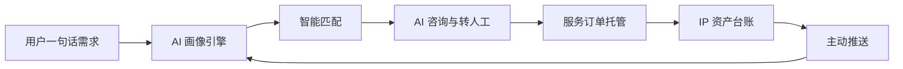

# A1+ IP Coworker · 投资人产品介绍

> **一句话定位**：**AI 法律操作系统 —— 让不懂知识产权的小微创业者，也能像大公司一样保护自己的品牌与技术。**
>
> 本文档面向非技术读者，讲透"我们做什么、为什么值得投、AI 到底在哪里、未来怎么长大"。

---

## 一、项目简介 · 我们解决什么问题

**知识产权是中国小微企业最容易"踩坑"的第一道合规题，却也是他们最难跨过的门槛。**

中国有约 **6000 万** 户小微经营主体，每天都有新公司起名、设计 LOGO、写代码、谈合作 —— 而这背后的商标、专利、软著、合同 IP 条款几乎无人看管。现状是三端同时失灵：

| 端 | 典型用户 | 真实痛点 |
|---|---|---|
| **C 端 · 创业者** | 个体户、SaaS 创始人、电商卖家 | 不知道要保护什么、去哪保护、怕花冤枉钱；一次商标代理 3000–5000 元，一次 IP 诊断动辄上万 |
| **B 端 · 律师与代理机构** | 约 30 万从业者 | 获客靠买冷名单、电话销售；线索质量低、转化周期长、ROI 不透明 |
| **E 端 · 成长期企业** | 融资前公司、中小品牌方 | 合规靠一次性 PDF 报告；政策、续展、侵权预警全靠人肉盯 |

**A1+ IP Coworker 把这三件事串成一件事**：用一个 AI 驱动的协作平台，让创业者一句话说清需求，AI 自动生成方案、匹配律师、管理资产、主动预警，律师端与企业端则各自拿到"温线索"和"持续合规驾驶舱"。

**"以前 vs 现在"一张表对比**：

| 维度 | 传统做法 | A1+ 做法 |
|---|---|---|
| 注册一个商标 | 找代理 · 2 周 · 3000–5000 元 | AI 10 分钟出可提交的申请书 · 成本降 **80–95%** |
| 找到合适的律师 | 平台搜索 / 朋友介绍，无从比较 | Top 3 推荐 · 每位附"为什么是 TA"的解释 |
| 持续合规 | 买一次报告，过一年失效 | 合规分 + 风险热力 + 政策雷达，持续在线 |

---

## 二、业务价值 · 对用户和市场的实际意义

### 1. 对 C 端创业者 —— 从"不敢碰"到"随手做"

- 注册商标、申请软著、签合同审条款这些过去需要专业门槛的事，现在全部压缩到"对 AI 说一句话"
- 一次画像、终身复用：诊断结果自动带入查重，查重结果自动生成申请书，生成后自动入资产台账并设置续展提醒，**用户只输入一次信息**
- **量化价值**：注册首个商标的综合成本（时间 + 费用 + 试错）从 3000–5000 元压到数百元量级

### 2. 对 B 端律师与代理机构 —— 从"冷名单"到"温线索"

- 每条线索带三件事：**用户画像**（意图 / 预算 / 紧迫度 / 地域）、**匹配分**、**命中原因**
- 五阶段获客漏斗（派发 → 查看 → 认领 → 报价 → 成交）+ ROI 报表，把过去算不清的获客效率第一次量化
- 对律所的意义：**把销售从打电话的人变成接订单的人**

### 3. 对 E 端成长期企业 —— 从"一次性报告"到"持续运营"

- 合规分 + 五维风险热力图 + 政策雷达 + 订阅分层，企业法务第一次拥有"IP 合规驾驶舱"
- 发现问题时一键委托 —— 直接在系统内下单给平台律师，闭环到 C 端的咨询与订单体系

### 4. 对投资人 —— 三档变现叠加 + 数据网络效应

- **三条变现曲线同时打开**：C 端成交佣金 + B 端席位订阅 / 线索计费 + E 端合规 SaaS 分层订阅
- **一条画像，三端复用**：C 端的需求画像就是 B 端的精准线索，也是 E 端合规画像的输入 —— 数据边际成本趋近于零
- **市场空间**：中国 IP 代理服务市场规模近千亿，LegalTech 整体渗透率 **不足 5%**，是典型的"技术渗透缺口型"蓝海

---

## 三、AI 创新性 · AI 在哪里、为什么是核心

> **我们不是把 AI 贴在旧流程上，而是让 AI 成为操作系统的内核，串起了整条法律服务链路。**

AI 在 A1+ 中同时承担四个关键角色 —— 任何一个拿掉，产品都会退化成"又一个表单工具"：

### 1. 一句话 → 结构化需求指纹

用户只需随口说一句"我在做跨境电商，刚起了个产品名，想尽快保护"，AI 会在不到一秒内抽出：**想做什么**（商标注册）、**多急**（紧迫度高）、**多大预算**、**在哪里**（上海 + 欧洲）、**关键词标签**。这张"需求指纹"是全系统唯一的数据源头，也是三端复用的起点。

### 2. 可解释 AI 匹配 —— 每一次推荐都说得清理由

AI 为用户推荐的每一位律师都带一段自然语言解释，例如："**推荐李律师（92 分）：专长跨境商标 · 上海本地可面签 · 近 3 个月处理过 12 件同类案件 · 平均响应 2.3 小时。**"对比行业普遍的"黑箱打分"，这对 C 端的信任和 B 端的转化都是代际差异。

### 3. AI 法务 Agent —— 12 项可调用的专业技能

系统内置一个贯穿全站的 AI 法务大脑，它掌握 12 项专业技能：商标查重、IP 诊断、资产盘点、申请书生成、合同条款审查、专利评估、政策速递、律师匹配、询价下单、咨询发起、合规扫描、诉讼胜率预测。用户不需要学习菜单，**只要提问，AI 自动挑工具、自动给结果；遇到高风险或低置信的场景，自动引导转到真人律师**。

### 4. AI 场景化主动推送 —— 从"被动工具"变"主动顾问"

12+ 条主动触达规则，把"该办事了"推到用户面前：资产临期自动催续展、商标有红旗自动预警、政策突变自动摘要、诉讼高风险自动提醒。**这一条是商业模型能否长期成立的关键** —— 用户不会每天打开产品，但产品必须每周找到理由激活用户。

**一句话收口**：没有 AI，就没有"一张画像喂三端"的飞轮；AI 退化，整个平台退化成表单 SaaS。

---

## 四、技术实现 · 整体思路

投资人只需记住三件事即可：

### 一条主干 · 飞轮闭环

用户每一次行为都会回灌画像，闭环自我增强 —— 这就是"法律 OS"与"工具 SaaS"的根本区别。

### 一套底座 · 网页端 + 服务端 + 异步作业器

- 网页端：浏览器打开即用，无需安装，也支持企业私有部署
- 服务端：统一的业务与 AI 调度层
- 异步作业器：商标、合同、监控、政策、诉讼等耗时任务在后台并发处理

### 四道护城河 · 投资人最关心的"能不能规模化、可不可靠"

1. **AI 有兜底**：主模型失效时自动回落到规则引擎，产品永不白屏
2. **结果可追溯**：每条 AI 输出都带数据来源与可解释原因，对监管、对客户都能交代
3. **法律边界明确**：只做"辅助准备"，不代替用户向官方系统递交 —— 合规风险前置可控
4. **能力可替换**：每个模块通过标准接口与外部对接，未来换更强的模型、接更多数据源零迁移成本

> **业务可演示 / 技术可扩展 / 法律可交付。**

---

## 五、交互与设计 · 关键流程或界面

A1+ 把同一套 AI 能力，分别包装成三类完全不同的工作空间，用"三个驾驶舱 + 一个贯穿助手"构成整体体验。

### 1. C 端创业者主旅程（7 步）

**① 注册 → ② 一句话说需求 → ③ 看到属于自己的画像卡 → ④ 收到 Top 3 律师推荐 → ⑤ 一键发起咨询 → ⑥ 在线签约 + 托管支付 → ⑦ 资产自动入台账 + 到期自动提醒**

关键设计点：流程之间的信息**自动串起来**，用户从头到尾只输入一次需求，所有后续都是"确认 / 选择"。

### 2. B 端律师工作台

- **线索池**：所有线索带温度标签（热 / 温 / 冷），一眼可见哪些值得立刻跟进
- **五阶段漏斗**：派发 → 查看 → 认领 → 报价 → 成交，转化瓶颈看得见
- **ROI 报表**：每一份成交订单回溯到最初的线索来源，第一次让律所"花了多少买了多少钱"变得透明

### 3. E 端企业合规驾驶舱

- **合规分**：一眼知道当前企业的 IP 合规水位
- **五维风险热力图**：覆盖商标、专利、软著、合同、政策五条风险线
- **政策雷达**：行业政策变化即时订阅
- **一键委托**：发现风险 → 直接下单给平台律师，从"知道问题"到"解决问题"不跳出产品

### 4. 贯穿全站的 AI 助手 · 设计语言三要点

- **浮动 AI 助手常驻右下**，任何页面随时追问，用户永不迷路
- **所有 AI 输出统一附"仅供参考，以官方为准"免责声明**，法律风险前置披露
- **每个模块入口都有"归属支柱徽章"**，让用户一眼看懂自己处在闭环的哪一环

---

## 六、未来前景与商业前瞻

A1+ 的长期价值在于三条增长曲线叠加：

### 曲线一 · 能力纵向加深 —— 单客付费天花板向上

诉讼胜率预测、融资 IP 尽调、跨境 IP 布局、合规订阅分层，每一项深度能力都能把客单价从百元级推到数千甚至上万元级。我们已经把这些能力写进了产品主线，而不是"远景规划"。

### 曲线二 · 数据飞轮横向扩张 —— 护城河逐年加厚

**画像 × 订单 × 合规事件** 三类数据的交叉沉淀，三年内将构成行业最大的"中国小微企业 IP 真实需求"数据库。这是任何后来者用再多资金也难以在短期内重建的资产。

### 曲线三 · 生态化 —— 成为 LegalTech 的结算层

对接电子签、托管支付、官方数据源、大模型供应方，A1+ 的目标不是某一个应用，而是成为中国小微企业 IP 服务市场的**入口与结算层**。

---

> **今天，我们卖的是一款 AI 工具；三年后，我们卖的是整个中国小微企业 IP 服务市场的入口。**

---

*免责声明：A1+ IP Coworker 仅提供文件准备与流程引导，不代替用户向任何官方系统提交申报；所有 AI 输出仅供参考，以官方为准。*
